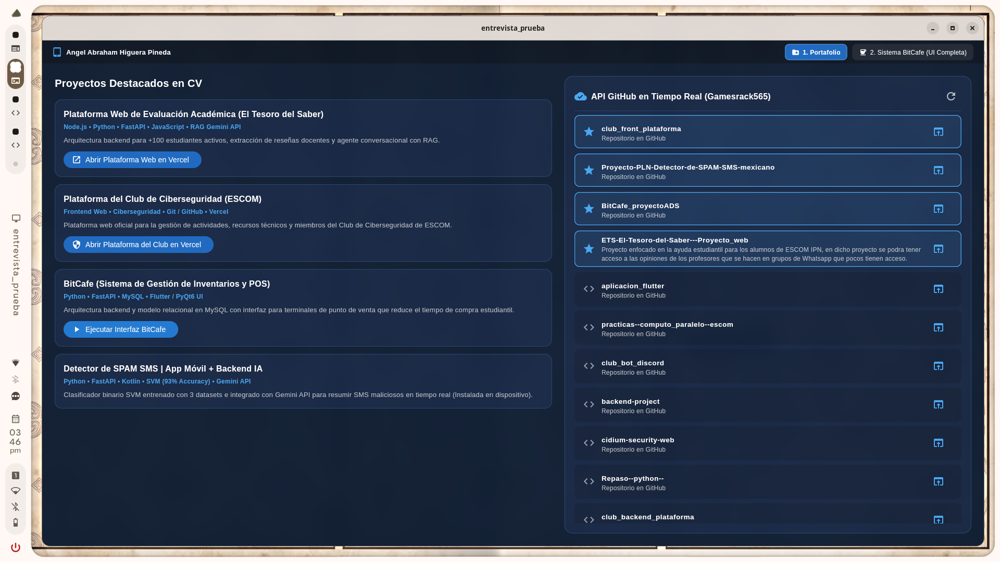

# aplicacion_flutter


Aplicación móvil y para tablet desarrollada en **Flutter y Dart** con diseño responsivo en orientación horizontal (*Landscape*). El proyecto integra dos módulos principales en una sola arquitectura: un **Portafolio Técnico Interactivo** conectado en tiempo real a la API REST de GitHub y la migración completa de la interfaz del sistema de punto de venta e inventarios **BitCafe POS**.

---

## Vista Previa del Diseño Final



---

## Módulos del Sistema

### 1. Portafolio Técnico & Consumo de API REST (`features/portfolio`)
* **Consumo de API en Tiempo Real:** Cliente HTTP asíncrono (`package:http`) que consulta el endpoint `https://api.github.com/users/Gamesrack565/repos?sort=updated`, deserializa la respuesta JSON y prioriza automáticamente los repositorios destacados del CV.
* **Resiliencia de Red (Modo Fallback Offline):** Implementación de manejo de excepciones (`SocketException`, `TimeoutException` a 6 segundos) que conmuta de forma transparente a un caché local de respaldo si el dispositivo pierde la conexión a Internet, evitando pantallas de error frente al usuario.
* **Integración con Despliegues en Producción:** Lanzamiento directo de aplicaciones web alojadas en **Vercel** (*El Tesoro del Saber* y *Plataforma del Club de Ciberseguridad ESCOM*) mediante `url_launcher` y configuración de visibilidad de paquetes (`<queries>`) en Android 11+ / HarmonyOS.

### 2. Sistema BitCafe — Punto de Venta e Inventarios (`features/bitcafe`)
Migración nativa a Flutter del sistema de gestión para cafetería (originalmente diseñado en Python/PyQt6 con backend en FastAPI y MySQL), respetando su sistema de diseño (`#D22A00` y `#FFEFEA`):
* **Portada de Conexión:** Validación inicial de estado del sistema y control de sesión.
* **Dashboard de Métricas (KPIs):** Cálculo reactivo en tiempo real de pedidos nuevos, órdenes en cocina, total de ventas acumuladas del día e historial de folios recientes.
* **Terminal de Punto de Venta (Pedido Manual):** Buscador predictivo con autocompletado (`Autocomplete<ProductoBitCafe>`), gestión dinámica de cantidades en el carrito y cálculo automático de totales.
* **Tablero Kanban en Tiempo Real:** Flujo visual de trabajo dividido en 3 columnas (*Nuevos* $\rightarrow$ *En preparación* $\rightarrow$ *Listos*) para la gestión de comandas en cocina.
* **Administración de Menú y Ajustes:** Filtrado de catálogo en vivo y control de disponibilidad de productos mediante interruptores reactivos (`Switch`).

---

## Arquitectura del Proyecto (Feature-First Modular)

El código está estructurado bajo una arquitectura modular por funcionalidades (**Feature-First**), separando la lógica de negocio, el consumo de datos, los modelos de dominio y la interfaz de usuario:

```text
lib/
├── core/
│   └── constants/
│       └── app_colors.dart            # Tokens de diseño y paletas de colores (Portafolio y BitCafe)
├── features/
│   ├── portfolio/
│   │   ├── services/
│   │   │   └── github_service.dart    # Capa de datos: Peticiones HTTP GET, timeouts y fallback local
│   │   └── views/
│   │       └── portfolio_screen.dart  # Vista dividida (55% Proyectos / 45% FutureBuilder API GitHub)
│   └── bitcafe/
│       ├── models/
│       │   └── bitcafe_models.dart    # Entidades de dominio (ProductoBitCafe y PedidoBitCafe)
│       └── views/
│           └── bitcafe_screen.dart    # Vistas modulares: Dashboard, POS, Kanban, Menú y Ajustes
└── main.dart                          # Punto de entrada, bloqueo horizontal e inyección dinámica de ThemeData